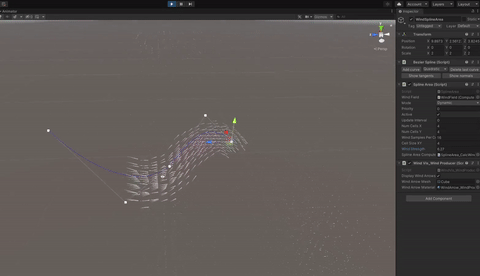

# vector-field-creator
#### A vector field system for Unity, and editor tool for the creation of vector field data

|  |  | 
|:----:|:----:|

## About
This project presents a performant compute shader-driven 3D vector field system for Unity, along with editor tools for easily creating vector field data in the Unity editor.

## Features
### Vector field
A vector field can be placed in the game world, and has configurable size, cell cize, global vector, and global Simplex-like noise.

### Vector data creation tools
Included are a number of "vector producer" tools which the user can place in a scene to add data to a vector field. These include single vectors, splines, splines with area, and cuboid areas. Each producer can be static - unchanging during gameplay - or dynamic - able to be changed during gameplay. Static producers have no performance cost during gameplay, while each dynamic producer incurs a performance cost during gameplay which is proportional to the number of individual vectors it represents.

## Implementation 
Both the vector field and the vector producers are implemented using compute shaders, taking advantage of the GPU's capability for highly parallel processing to deliver good performance even for large vector fields.